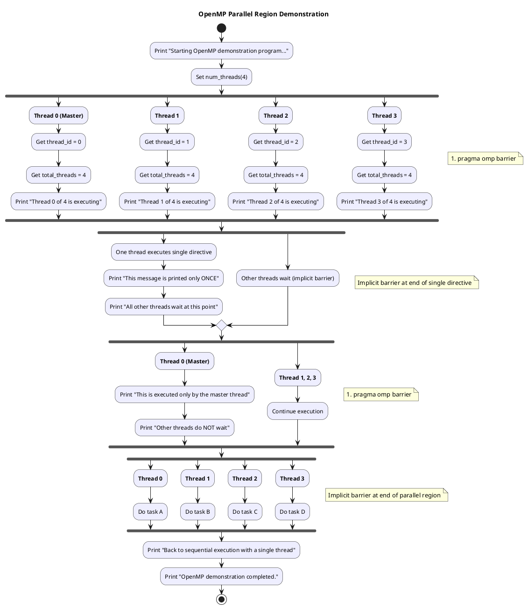

# OpenMP Parallel Region Demonstration

This repository contains a simple C++ program that demonstrates the basic features of OpenMP parallel programming.

## Overview

The `openmp_parallel_demo.cpp` program shows how to:

- Create a parallel region with multiple threads
- Identify thread IDs and count total threads
- Demonstrate the difference between code executed by all threads and code executed by a single thread
- Use OpenMP directives like `parallel`, `single`, `master`, and `barrier`

## Full Source Code

Here is the complete source code of the example:

```c
/**
 * OpenMP Parallel Region Demonstration
 * This program shows the basic usage of OpenMP parallel regions
 * 
 * Compilation instructions:
 * - For GCC/G++: g++ -fopenmp openmp_parallel_demo.cpp -o openmp_demo
 * - For MSVC: cl /openmp openmp_parallel_demo.cpp
 */

#include <iostream>   // For standard input/output operations
#include <omp.h>      // OpenMP header for parallel programming directives

int main() {
    std::cout << "Starting OpenMP demonstration program..." << std::endl;
    std::cout << "Sequential code before parallel region is executed by a single thread" << std::endl;

    // Set the number of threads for the parallel region
    omp_set_num_threads(4);

    // Create a parallel region with 4 threads
    // Each thread will execute the code inside this region
    #pragma omp parallel
    {
        // This code is executed by all threads in the parallel region
        int thread_id = omp_get_thread_num();    // Get current thread ID
        int total_threads = omp_get_num_threads(); // Get total number of threads

        // Each thread will print its own ID and the total number of threads
        std::cout << "Thread " << thread_id << " of " << total_threads << " is executing" << std::endl;

        // Create a barrier to synchronize all threads at this point
        #pragma omp barrier

        // Demonstration of code that runs ONCE by a single thread
        #pragma omp single
        {
            std::cout << "\nThis message is printed only ONCE by thread " 
                      << omp_get_thread_num() << std::endl;
            std::cout << "All other threads wait at this point due to implicit barrier" << std::endl;
        }
        // Implicit barrier at the end of the single directive

        // Demonstration of code that runs by the master thread only
        #pragma omp master
        {
            std::cout << "\nThis is executed only by the master thread (thread 0)" << std::endl;
            std::cout << "Other threads do NOT wait (no implicit barrier)" << std::endl;
        }
        // No implicit barrier after master

        // Ensure all threads synchronize before proceeding
        #pragma omp barrier

        // Example of thread-specific work - each thread performs a different task
        if (thread_id == 0) {
            std::cout << "Thread 0 is doing task A" << std::endl;
        } else if (thread_id == 1) {
            std::cout << "Thread 1 is doing task B" << std::endl;
        } else if (thread_id == 2) {
            std::cout << "Thread 2 is doing task C" << std::endl;
        } else {
            std::cout << "Thread " << thread_id << " is doing task D" << std::endl;
        }
    }
    // End of parallel region - implicit barrier here

    std::cout << "\nBack to sequential execution with a single thread" << std::endl;
    std::cout << "OpenMP demonstration completed." << std::endl;

    return 0;
}
```

## Visual



## Installation Instructions

### Windows

#### Option 1: Visual Studio

1. **Install Visual Studio Community Edition**:
   
   - Download [Visual Studio](https://visualstudio.microsoft.com/vs/community/)
   - During installation, select "Desktop development with C++" workload
   - OpenMP support is included by default

2. **Create a new project**:
   
   - Open Visual Studio
   - Create a new C++ Console Application
   - Copy the example code into the main source file
   - In project properties, ensure OpenMP support is enabled:
     - Right-click the project → Properties
     - C/C++ → Language → OpenMP Support → Set to "Yes (/openmp)"

3. **Build and Run**:
   
   - Press F5 or click the "Local Windows Debugger" button

#### Option 2: MinGW/GCC

1. **Install MinGW-w64**:
   
   - Download [MinGW-w64](https://winlibs.com/) or install via [MSYS2](https://www.msys2.org/)
   
   - For MSYS2, after installation, open MSYS2 terminal and run:
     
     ```
     pacman -Syu
     pacman -S mingw-w64-x86_64-gcc
     ```
   
   - Add MinGW bin directory to PATH (e.g., `C:\msys64\mingw64\bin`)

2. **Compile and Run**:
   
   - Open Command Prompt
   - Navigate to your code directory
   - Compile with: `g++ -fopenmp openmp_parallel_demo.cpp -o openmp_demo`
   - Run with: `openmp_demo`

### Linux

1. **Install GCC and OpenMP**:
   
   - Debian/Ubuntu: `sudo apt-get install gcc g++ libomp-dev`
   - Fedora/RHEL: `sudo dnf install gcc gcc-c++ libomp-devel`

2. **Compile and Run**:
   
   - Navigate to your code directory
   - Compile with: `g++ -fopenmp openmp_parallel_demo.cpp -o openmp_demo`
   - Run with: `./openmp_demo`

### macOS

1. **Install Xcode Command Line Tools**:
   
   - Run: `xcode-select --install`

2. **Install GCC with OpenMP (Homebrew)**:
   
   - Install Homebrew: `/bin/bash -c "$(curl -fsSL https://raw.githubusercontent.com/Homebrew/install/HEAD/install.sh)"`
   - Install GCC: `brew install gcc`

3. **Compile and Run**:
   
   - Navigate to your code directory
   - Compile with: `g++-13 -fopenmp openmp_parallel_demo.cpp -o openmp_demo` (replace 13 with your GCC version)
   - Run with: `./openmp_demo`

## Requirements

To compile and run this program, you need:

- A C++ compiler with OpenMP support:
  - GCC/G++ (version 4.2 or later)
  - Microsoft Visual C++ (Visual Studio 2005 or later)
- Basic knowledge of command-line operations

## Compilation Instructions

### Using GCC/G++

```bash
g++ -fopenmp openmp_parallel_demo.cpp -o openmp_demo
```

### Using Microsoft Visual C++

First, set up the Visual Studio environment (if not already in a Developer Command Prompt):

```bash
"C:\Program Files\Microsoft Visual Studio\2022\Community\VC\Auxiliary\Build\vcvarsall.bat" x64
```

Then compile:

```bash
cl /openmp /EHsc openmp_parallel_demo.cpp
```

## Running the Program

After compilation, run the executable:

- For GCC/G++ compilation:
  
  ```bash
  ./openmp_demo     # On Linux/macOS
  openmp_demo.exe   # On Windows
  ```

- For MSVC compilation:
  
  ```bash
  openmp_parallel_demo.exe
  ```

## Expected Output

When you run the program, you'll see output similar to:

```bash
Starting OpenMP demonstration program...
Sequential code before parallel region is executed by a single thread
Thread 0 of 4 is executing
Thread 1 of 4 is executing
Thread 3 of 4 is executing
Thread 2 of 4 is executing

This message is printed only ONCE by thread 0
All other threads wait at this point due to implicit barrier

This is executed only by the master thread (thread 0)
Other threads do NOT wait (no implicit barrier)

Thread 0 is doing task A
Thread 1 is doing task B
Thread 2 is doing task C
Thread 3 is doing task D

Back to sequential execution with a single thread
OpenMP demonstration completed.
```

Note: The exact order of thread execution may vary between runs.

## Key Concepts Demonstrated

1. **Parallel Region**: Created with `#pragma omp parallel`, defines a section of code executed by multiple threads.

2. **Thread Identification**: Using `omp_get_thread_num()` and `omp_get_num_threads()` to identify threads.

3. **Single Thread Execution**: Using `#pragma omp single` to have a section of code executed by only one thread.

4. **Master Thread Execution**: Using `#pragma omp master` to have a section of code executed only by the master thread (thread 0).

5. **Barriers**: Using `#pragma omp barrier` to synchronize all threads at a specific point.

## Further Learning

To learn more about OpenMP:

- [Official OpenMP website](https://www.openmp.org/)
- [OpenMP Specifications](https://www.openmp.org/specifications/)
- [OpenMP Tutorial](https://computing.llnl.gov/tutorials/openMP/)

## License

This code is provided for educational purposes and is free to use and modify. 