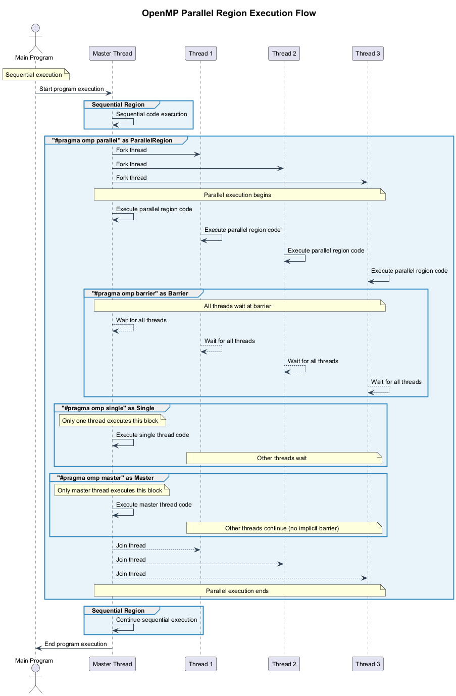

# 🔰 OpenMP Parallel Region Demonstration

This repository contains a simple C++ program that demonstrates the basic features of OpenMP parallel programming.

## 📋 Overview

The `openmp_parallel_demo.cpp` program shows how to:

- Create a parallel region with multiple threads
- Identify thread IDs and count total threads
- Demonstrate the difference between code executed by all threads and code executed by a single thread
- Use OpenMP directives like `parallel`, `single`, `master`, and `barrier`

## 🔄 OpenMP Parallel Region Execution Flow

The following diagram illustrates how OpenMP parallel regions work, showing the fork-join model and the execution flow through different OpenMP constructs:



## 💻 Full Source Code

Here is the complete source code of the example:

```c
/**
 * OpenMP Parallel Region Demonstration
 * This program shows the basic usage of OpenMP parallel regions
 * 
 * Compilation instructions:
 * - For GCC/G++: g++ -fopenmp openmp_parallel_demo.cpp -o openmp_demo
 * - For MSVC: cl /openmp openmp_parallel_demo.cpp
 */

#include <iostream>   // For standard input/output operations
#include <omp.h>      // OpenMP header for parallel programming directives

int main() {
    std::cout << "Starting OpenMP demonstration program..." << std::endl;
    std::cout << "Sequential code before parallel region is executed by a single thread" << std::endl;

    // Set the number of threads for the parallel region
    omp_set_num_threads(4);

    // Create a parallel region with 4 threads
    // Each thread will execute the code inside this region
    #pragma omp parallel
    {
        // This code is executed by all threads in the parallel region
        int thread_id = omp_get_thread_num();    // Get current thread ID
        int total_threads = omp_get_num_threads(); // Get total number of threads

        // Each thread will print its own ID and the total number of threads
        std::cout << "Thread " << thread_id << " of " << total_threads << " is executing" << std::endl;

        // Create a barrier to synchronize all threads at this point
        #pragma omp barrier

        // Demonstration of code that runs ONCE by a single thread
        #pragma omp single
        {
            std::cout << "\nThis message is printed only ONCE by thread " 
                      << omp_get_thread_num() << std::endl;
            std::cout << "All other threads wait at this point due to implicit barrier" << std::endl;
        }
        // Implicit barrier at the end of the single directive

        // Demonstration of code that runs by the master thread only
        #pragma omp master
        {
            std::cout << "\nThis is executed only by the master thread (thread 0)" << std::endl;
            std::cout << "Other threads do NOT wait (no implicit barrier)" << std::endl;
        }
        // No implicit barrier after master

        // Ensure all threads synchronize before proceeding
        #pragma omp barrier

        // Example of thread-specific work - each thread performs a different task
        if (thread_id == 0) {
            std::cout << "Thread 0 is doing task A" << std::endl;
        } else if (thread_id == 1) {
            std::cout << "Thread 1 is doing task B" << std::endl;
        } else if (thread_id == 2) {
            std::cout << "Thread 2 is doing task C" << std::endl;
        } else {
            std::cout << "Thread " << thread_id << " is doing task D" << std::endl;
        }
    }
    // End of parallel region - implicit barrier here

    std::cout << "\nBack to sequential execution with a single thread" << std::endl;
    std::cout << "OpenMP demonstration completed." << std::endl;

    return 0;
}
```

## 🧵 OpenMP Directives Explained

### 1. `#pragma omp parallel`

This directive creates a team of threads that execute the enclosed code block in parallel. The number of threads is determined by:
- Default: The number of available hardware cores
- Environment: OMP_NUM_THREADS environment variable
- Code: omp_set_num_threads() function call

### 2. `#pragma omp single`

This directive specifies that the enclosed code block should be executed by only one thread from the team, not necessarily the master thread. Other threads wait at the end of the block (implicit barrier).

### 3. `#pragma omp master`

Similar to `single`, but specifically executed by the master thread (thread 0). Other threads skip this code and continue execution (no implicit barrier).

### 4. `#pragma omp barrier`

Forces all threads to wait at this point until all threads in the team have reached it. Ensures synchronization among threads.

## 🚀 Compiling and Running

### On Windows with MSVC:

```bash
cl /openmp openmp_parallel_demo.cpp
openmp_parallel_demo.exe
```

### On Linux/macOS with GCC:

```bash
g++ -fopenmp openmp_parallel_demo.cpp -o openmp_demo
./openmp_demo
```

## 🔍 Key Learning Points

1. **Parallel Region Basics**: Understanding the fork-join model in OpenMP
2. **Thread Identification**: How to identify individual threads using `omp_get_thread_num()`
3. **Thread Synchronization**: Using barriers and other synchronization mechanisms
4. **Single vs. Master Execution**: Understanding the difference between single and master directives
5. **Thread Team Management**: Working with a team of threads in a parallel region

## 📚 Additional Resources

- [OpenMP API Specification](https://www.openmp.org/specifications/)
- [OpenMP Tutorial on LLNL HPC](https://hpc-tutorials.llnl.gov/openmp/)

## License

This code is provided for educational purposes and is free to use and modify. 