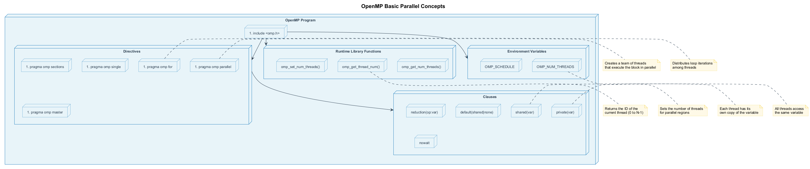
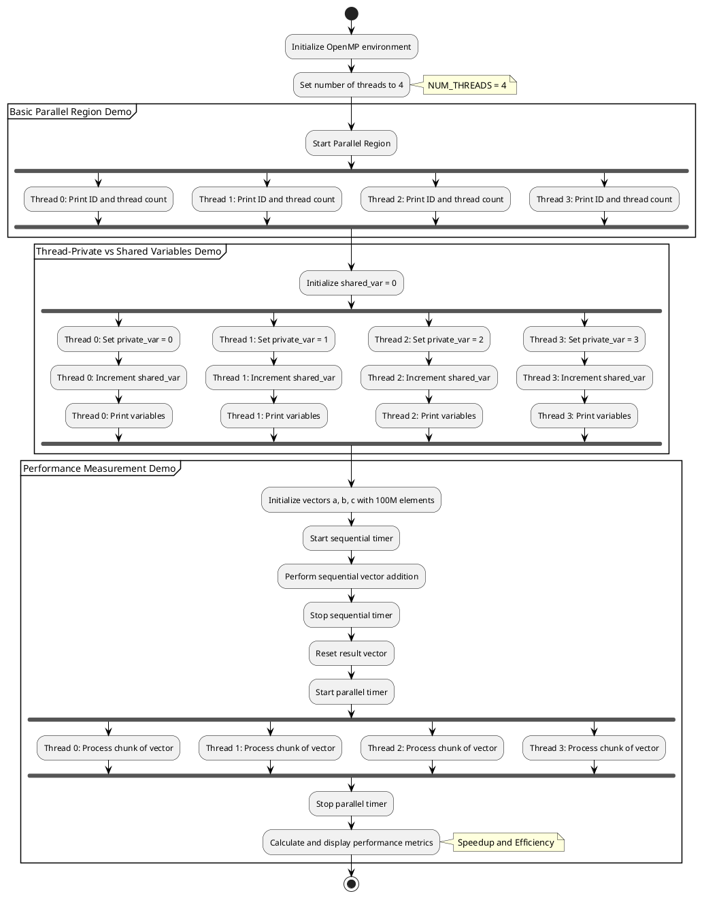

# 🔄 OpenMP Basic Parallel Operations

This project demonstrates the fundamental concepts of OpenMP parallel programming with simple examples.

## 🎯 Overview

OpenMP (Open Multi-Processing) is an API that supports multi-platform shared memory multiprocessing programming in C, C++, and Fortran. It consists of compiler directives, library routines, and environment variables that influence runtime behavior.

## 📋 Basic OpenMP Concepts

The following diagram illustrates the core components and concepts of OpenMP:



## 🧩 Key Components

### 1. Directives

OpenMP directives are compiler instructions that define parallel regions and operations:

- `#pragma omp parallel`: Creates a team of threads
- `#pragma omp for`: Distributes loop iterations among threads
- `#pragma omp sections`: Divides code into discrete sections executed by different threads
- `#pragma omp critical`: Ensures exclusive access to a code block
- `#pragma omp barrier`: Synchronizes all threads at a specific point

### 2. Clauses

Clauses provide additional information to directives:

- `private(var)`: Each thread has its own copy of the variable
- `shared(var)`: All threads access the same variable
- `reduction(op:var)`: Combines thread-specific variables using an operation
- `default(shared|none)`: Sets the default variable sharing attribute
- `nowait`: Removes the implicit barrier at a directive's end

### 3. Runtime Library Functions

OpenMP provides functions to control and query the parallel execution:

- `omp_get_num_threads()`: Returns the number of threads in the current team
- `omp_get_thread_num()`: Returns the ID of the calling thread
- `omp_set_num_threads()`: Sets the number of threads for subsequent parallel regions
- `omp_in_parallel()`: Returns true if called from within a parallel region

### 4. Environment Variables

Environment variables control OpenMP behavior:

- `OMP_NUM_THREADS`: Sets the default number of threads
- `OMP_SCHEDULE`: Sets the default schedule type and chunk size
- `OMP_STACKSIZE`: Sets the stack size for each thread

## 💻 Examples in This Project

This project includes the following examples:

1. **Basic Parallel Region**: Demonstrates creating a team of threads and distributing work
2. **Thread Information**: Shows how to identify threads and query information
3. **Work Sharing**: Illustrates different methods of distributing work among threads
4. **Data Scoping**: Showcases variable sharing and privatization techniques

## 🚀 Running the Examples

Use the provided scripts to configure, build, and run the examples:

1. Run `configure.bat` to set up the CMake project
2. Run `build_all.bat` to compile all examples
3. Run `run.bat` to execute the examples

Example usage:

```bash
run.bat --debug --example basic_parallel
```

## 📚 Additional Resources

- [OpenMP API Specification](https://www.openmp.org/specifications/)
- [OpenMP Tutorial on LLNL HPC](https://hpc-tutorials.llnl.gov/openmp/)
- [Best Practices for OpenMP](https://www.openmp.org/wp-content/uploads/openmp-examples-4.5.0.pdf)

# OpenMP Basic Parallel Demo

This project demonstrates the fundamental concepts of parallel programming using OpenMP in C++. It is designed to work with Visual Studio 2022 on Windows and is configured using CMake.

## Project Purpose

This demo showcases:

1. How to set up a basic OpenMP project with CMake
2. Basic parallel region execution with thread identification
3. The difference between thread-private and shared variables
4. Performance measurement comparing sequential and parallel execution

## Prerequisites

- Windows 10/11
- Visual Studio 2022 Community Edition or higher
- CMake 3.20 or higher
- C++17 compatible compiler

## Building and Running

### Step 1: Configure the Project

Run the `configure.bat` script to generate the Visual Studio project files:

```
configure.bat
```

This will:

- Create a `build` directory (if it doesn't exist)
- Run CMake with the Visual Studio 2022 generator

### Step 2: Build the Project

Run the `build_all.bat` script to compile the project in Debug, Release, and Profile configurations:

```
build_all.bat
```

### Step 3: Run the Program

Use the unified `run.bat` script with various options:

```
run.bat                      # Run with default settings (Release mode)
run.bat --debug              # Run in Debug mode with additional diagnostics
run.bat --release            # Run in Release mode (optimized performance)
run.bat --threads 8          # Run with 8 threads
run.bat --verbose            # Run with verbose output
run.bat --help               # Show all available options
```

For the most comprehensive experience, you can use:

```
run_all.bat                  # Run all demonstrations in sequence
```

**Note**: For accurate performance comparisons, always use the Release build as it includes full compiler optimizations.

### Step 4: Clean the Project (Optional)

If you want to clean the build files and start from scratch, run the `clean.bat` script:

```
clean.bat
```

This will:

- Remove the build, bin, and reports directories and their contents
- Provide instructions for rebuilding the project

## Expected Output

The program demonstrates three key aspects of OpenMP:

1. **Basic Parallel Region Demo:**
   
   - Each thread prints its ID and the total number of threads
   - You should see output from multiple threads (by default, thread 0-3)

2. **Thread-Private vs Shared Variables Demo:**
   
   - Shows how each thread has its own private variables
   - Demonstrates how shared variables are accessed by all threads

3. **Performance Measurement Demo:**
   
   - Performs vector addition sequentially and in parallel
   - Measures and compares execution times
   - Calculates speedup and efficiency

## Program Workflow Visualization

The following PlantUML activity diagram illustrates the program workflow, highlighting the parallel processing aspects:



## Code Components

- `main.cpp`: Contains the OpenMP demo code
- `CMakeLists.txt`: CMake configuration file
- `configure.bat`, `build_all.bat`, `run.bat`, `run_all.bat`, `clean.bat`: Scripts for building, running, and cleaning

## Common Issues and Troubleshooting

### OpenMP Not Found

If you see "OpenMP is not supported!" when running the program:

- Make sure your compiler supports OpenMP
- Check that Visual Studio has the C++ desktop development workload installed

### Build Errors

- Ensure Visual Studio 2022 is properly installed
- Make sure you have the correct Visual Studio C++ components installed
- Try running the scripts as Administrator if you encounter permission issues

### Performance Issues

- The parallel speedup may vary depending on your hardware
- For best results, run the Release configuration using `run.bat --release`
- If you don't see significant speedup, try increasing the vector size in the code

## Advanced Usage

For a more challenging workload, you can modify the vector size in `main.cpp` by changing the `vector_size` constant.

## License

This project is provided as-is for educational purposes. 