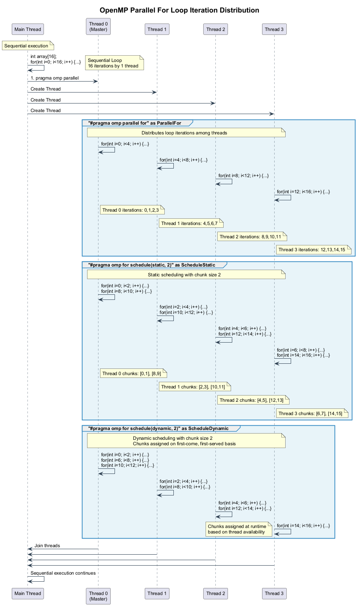

# 🔁 OpenMP Parallel For Loops

This project demonstrates how to use OpenMP to parallelize loops for better performance on multi-core systems.

## 🎯 Overview

Loop parallelization is one of the most common and effective ways to improve performance with OpenMP. This module covers different strategies for distributing loop iterations among threads and understanding the performance implications of each approach.

## 📊 Parallel For Loop Iteration Distribution

The following diagram illustrates how loop iterations are distributed among threads with different OpenMP scheduling strategies:



## 🧩 Key OpenMP Loop Constructs

### 1. Basic Parallel For

```cpp
#pragma omp parallel for
for (int i = 0; i < N; i++) {
    // Each iteration is executed by one thread
    process(i);
}
```

The `parallel for` directive combines a parallel region with a loop work-sharing construct, dividing the iterations among threads.

### 2. Schedule Clause Types

OpenMP provides several scheduling strategies to control how loop iterations are assigned to threads:

#### Static Scheduling

```cpp
#pragma omp parallel for schedule(static, chunk_size)
```

- Iterations are divided into chunks of size `chunk_size` (default: N/num_threads)
- Chunks are assigned to threads in a round-robin fashion
- **Advantage**: Low overhead, predictable assignment pattern
- **Best for**: Uniform workload per iteration

#### Dynamic Scheduling

```cpp
#pragma omp parallel for schedule(dynamic, chunk_size)
```

- Iterations are divided into chunks of size `chunk_size` (default: 1)
- Chunks are assigned to threads on a first-come, first-served basis
- **Advantage**: Better load balancing for uneven workloads
- **Best for**: Variable workload per iteration
- **Trade-off**: Higher scheduling overhead

#### Guided Scheduling

```cpp
#pragma omp parallel for schedule(guided, min_chunk_size)
```

- Chunks start large and decrease exponentially to `min_chunk_size`
- **Advantage**: Balances scheduling overhead and load balancing
- **Best for**: Variable workload with unknown distribution

#### Auto Scheduling

```cpp
#pragma omp parallel for schedule(auto)
```

- The compiler and runtime system determine the scheduling
- **Best for**: When you're not sure which schedule to use

#### Runtime Scheduling

```cpp
#pragma omp parallel for schedule(runtime)
```

- Scheduling is determined at runtime by the `OMP_SCHEDULE` environment variable
- **Best for**: Testing different schedules without recompiling

## 💻 Examples in This Project

This project includes the following examples:

1. **Basic Parallel For**: Simple demonstration of parallelizing a for loop
2. **Scheduling Comparison**: Performance comparison of different scheduling strategies
3. **Nested Loops**: Techniques for handling nested loops
4. **Loop Dependencies**: How to handle loops with dependencies between iterations

## 🚀 Running the Examples

Use the provided scripts to configure, build, and run the examples:

1. Run `configure.bat` to set up the CMake project
2. Run `build_all.bat` to compile all examples
3. Run `run.bat` to execute the examples

Example usage:

```bash
run.bat --debug --example scheduling_comparison
```

## 📈 Performance Considerations

1. **Iteration Count**: Ensure enough iterations to justify parallelization overhead
2. **Workload Balance**: Choose appropriate scheduling based on workload distribution
3. **Thread Count**: Too many threads can lead to excessive overhead
4. **Loop Body Size**: Small loop bodies may not benefit from parallelization
5. **Data Access Patterns**: Consider data locality and access patterns

## 📚 Additional Resources

- [OpenMP Loop Constructs](https://www.openmp.org/spec-html/5.0/openmpsu36.html)
- [Loop Scheduling Tutorial](https://hpc-tutorials.llnl.gov/openmp/for_scheduling/)
- [Performance Optimization Guide](https://www.openmp.org/wp-content/uploads/openmp-examples-4.5.0.pdf)

## Learning Objectives

This demo will help you understand:

1. How to use `#pragma omp parallel for` to parallelize loops
2. How to implement reduction operations with `#pragma omp parallel for reduction`
3. How threads distribute work in parallel for loops
4. How to measure and compare performance between sequential and parallel code
5. How to properly handle memory and errors in parallel programming

## Prerequisites

- Windows (tested on Windows 10/11)
- Visual Studio 2022 Community Edition or higher
- CMake 3.20 or higher
- C++17 compatible compiler

## Building and Running

### Step 1: Configure the Project

Run the `configure.bat` script to generate the Visual Studio project files:

```
configure.bat
```

This will:
- Create a `build` directory (if it doesn't exist)
- Run CMake with the Visual Studio 2022 generator

### Step 2: Build the Project

Run the `build_all.bat` script to compile the project in Debug, Release, and Profile configurations:

```
build_all.bat
```

### Step 3: Run the Program

Use the unified `run.bat` script with various options:

```
run.bat                      # Run with default settings (Release mode)
run.bat --debug              # Run in Debug mode with additional diagnostics
run.bat --release            # Run in Release mode (optimized performance)
run.bat --threads 8          # Run with 8 threads
run.bat --verbose            # Run with verbose output
run.bat --help               # Show all available options
```

For the most comprehensive experience, you can use:

```
run_all.bat                  # Run all demonstrations in sequence
```

**Note**: For accurate performance comparisons, always use the Release build as it includes full compiler optimizations.

### Step 4: Clean the Project (Optional)

If you want to clean the build files and start from scratch, run the `clean.bat` script:

```
clean.bat
```

This will:
- Remove the build, bin, and reports directories and their contents
- Provide instructions for rebuilding the project

## Program Workflow

This demo performs the following operations:

1. **Sequential Array Initialization**: Initializes 100 million integers sequentially
2. **Sequential Sum Calculation**: Sums the array elements sequentially
3. **Parallel Array Initialization**: Reinitializes the array using parallel for loop
4. **Thread Distribution Visualization**: Shows how work is distributed among threads
5. **Parallel Sum Calculation**: Uses parallel reduction to sum the array
6. **Performance Comparison**: Compares timing results and calculates speedup and efficiency

### Program Workflow Visualization


## Expected Output

The program outputs:

1. **OpenMP Information**: Version and thread count
2. **Sequential Performance**: Time taken for sequential initialization and sum
3. **Thread Distribution**: Visual representation of how work is divided among threads
4. **Parallel Performance**: Time taken for parallel initialization and sum
5. **Performance Comparison**: 
   - Speedup (sequential time / parallel time)
   - Efficiency (speedup / number of threads * 100%)

Example output:
```
=== OpenMP Parallel For Loop Demo ===
Array size: 100000000 integers
Maximum available threads: 8

Starting Sequential initialization...
Sequential initialization completed in 312 ms

Starting Sequential sum calculation...
Sequential sum calculation completed in 135 ms
Sequential sum result: 4950000000

Starting Parallel initialization...
Parallel initialization completed in 64 ms

Thread Distribution Visualization:
Thread  0: [         0 to  12499999]  12.50% ||||||
Thread  1: [ 12500000 to  24999999]  12.50% ||||||
...

Starting Parallel sum calculation with reduction...
Parallel sum calculation with reduction completed in 24 ms
Parallel sum result: 4950000000
✓ Sequential and parallel results match!

=== Performance Comparison ===
Initialization:
  Sequential: 312 ms
  Parallel: 64 ms
  Speedup: 4.88x
  Efficiency: 60.94%
Sum Calculation:
  Sequential: 135 ms
  Parallel: 24 ms
  Speedup: 5.63x
  Efficiency: 70.31%
```

## Understanding the Results

1. **Speedup < Number of Threads**: This is normal due to:
   - Thread creation overhead
   - Memory bandwidth limitations
   - Cache coherence overhead
   - Thread synchronization

2. **Better Reduction Performance**: Typically, reduction operations show better parallel efficiency because:
   - They have higher computation-to-memory-access ratio
   - Reduction combines results efficiently using a tree-like pattern

## Common Issues and Troubleshooting

### Memory Allocation Failures

If you encounter "Memory allocation failed":
- Reduce the `ARRAY_SIZE` constant in the code
- Close other memory-intensive applications
- Try running on a system with more RAM

### Performance Lower Than Expected

If parallel performance isn't significantly better:
- Ensure you're running the Release build (not Debug)
- Check if other CPU-intensive applications are running
- Verify your CPU supports multiple cores/threads
- Try increasing the array size for more significant workload

### Build Errors

For build errors:
- Ensure Visual Studio 2022 is properly installed with C++ components
- Verify that OpenMP is available in your compiler
- Run scripts as Administrator if permission issues occur

## Advanced Concepts

This demo demonstrates several important parallel programming concepts:

1. **Work Sharing**: OpenMP divides loop iterations among threads
2. **Reduction**: Combines partial results efficiently
3. **Thread Independence**: Each thread operates on separate data portions
4. **Parallel Overhead**: Thread creation and management costs
5. **Memory Bandwidth Limitations**: Often the bottleneck in data-intensive operations

## License

This project is provided as-is for educational purposes. 