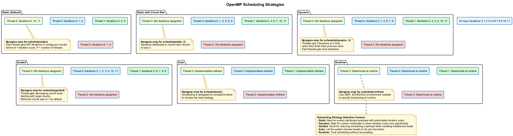

# ⚖️ OpenMP Scheduling Strategies

This project demonstrates different OpenMP scheduling strategies and their impact on performance, load balancing, and thread utilization when applied to non-uniform workloads.

## 🎯 Overview

OpenMP provides several scheduling strategies to distribute loop iterations among threads, each with distinct advantages for different workload types:

| Strategy | Description | Best For |
|----------|-------------|----------|
| **Static** | Pre-divides iterations equally at compile time | Uniform workloads |
| **Dynamic** | Assigns iterations on-demand as threads complete work | Non-uniform workloads |
| **Guided** | Similar to dynamic but with decreasing chunk sizes | Mixed workloads |
| **Auto** | Runtime system selects the scheduling method | Unknown characteristics |

## 📊 OpenMP Scheduling Strategies

The following diagram illustrates how different OpenMP scheduling strategies distribute iterations among threads:



## 🧩 Scheduling Clauses in OpenMP

```cpp
// Static scheduling: equal chunks pre-assigned to threads
#pragma omp parallel for schedule(static)
for (int i = 0; i < N; i++) {
    process(i);
}

// Static scheduling with custom chunk size
#pragma omp parallel for schedule(static, 4)
for (int i = 0; i < N; i++) {
    process(i);
}

// Dynamic scheduling: on-demand distribution
#pragma omp parallel for schedule(dynamic)
for (int i = 0; i < N; i++) {
    process(i);
}

// Dynamic scheduling with custom chunk size
#pragma omp parallel for schedule(dynamic, 4)
for (int i = 0; i < N; i++) {
    process(i);
}

// Guided scheduling: decreasing chunk sizes
#pragma omp parallel for schedule(guided)
for (int i = 0; i < N; i++) {
    process(i);
}

// Auto scheduling: implementation decides
#pragma omp parallel for schedule(auto)
for (int i = 0; i < N; i++) {
    process(i);
}

// Runtime scheduling: determined by environment variable
// export OMP_SCHEDULE="dynamic,4"
#pragma omp parallel for schedule(runtime)
for (int i = 0; i < N; i++) {
    process(i);
}
```

## 💻 Examples in This Project

This project includes the following examples:

1. **Static Scheduling**: Demonstrates the default block distribution and chunk-based variations
2. **Dynamic Scheduling**: Shows on-demand iteration assignment for better load balancing
3. **Guided Scheduling**: Illustrates the benefits of decreasing chunk sizes
4. **Auto & Runtime Scheduling**: Provides flexibility without code changes
5. **Non-uniform Workload**: Creates workload with varying computation times per iteration

## 📈 Performance Considerations

1. **Static Scheduling**: 
   - Lowest scheduling overhead
   - Best for evenly distributed workload
   - Poor performance with irregular computation

2. **Dynamic Scheduling**:
   - Higher scheduling overhead
   - Excellent load balancing for irregular workloads
   - Small chunk sizes increase overhead but improve balancing

3. **Guided Scheduling**:
   - Moderate overhead
   - Good compromise between static and dynamic
   - Handles moderately irregular workloads well

4. **Auto & Runtime**:
   - Flexibility without recompilation
   - Useful for tuning without code changes
   - Implementation-dependent behavior

## 🚀 Running the Examples

Use the provided scripts to configure, build, and run the examples:

1. Run `configure.bat` to set up the CMake project
2. Run `build_all.bat` to compile all examples
3. Run `run.bat` to execute the examples

Example usage:

```bash
run.bat                          # Run with default settings (Release mode)
run.bat --debug                  # Run in Debug mode with additional diagnostics
run.bat --release                # Run in Release mode (optimized performance)
run.bat --threads 8              # Run with 8 threads
run.bat --schedule dynamic       # Use dynamic scheduling strategy
run.bat --verbose                # Run with verbose output
```

For the most comprehensive experience, you can use:

```bash
run_all.bat                      # Run all demonstrations in sequence
```

## 📚 Additional Resources

- [OpenMP Scheduling Constructs](https://www.openmp.org/spec-html/5.0/openmpsu42.html)
- [Loop Scheduling Performance Guide](https://www.openmp.org/wp-content/uploads/openmp-examples-4.5.0.pdf)
- See the accompanying `SCHEDULING.md` for detailed explanations of each scheduling strategy

## Prerequisites

- Windows 10/11
- Visual Studio 2022 with C++ development tools
- CMake 3.20 or higher
- OpenMP support (included with Visual Studio)

## Building and Running

### Step 1: Configure
Run `configure.bat` to generate the Visual Studio project files:
```
configure.bat
```

### Step 2: Build
Run `build_all.bat` to compile Debug, Release, and Profile configurations:
```
build_all.bat
```

### Step 3: Run
Use the unified `run.bat` script with various options:

```
run.bat                          # Run with default settings (Release mode)
run.bat --debug                  # Run in Debug mode with additional diagnostics
run.bat --release                # Run in Release mode (optimized performance)
run.bat --threads 8              # Run with 8 threads
run.bat --schedule dynamic       # Use dynamic scheduling strategy
run.bat --verbose                # Run with verbose output
run.bat --help                   # Show all available options
```

For specific scheduling strategy comparisons, we also provide:

```
run.bat --schedule static        # Use static scheduling
run.bat --schedule dynamic       # Use dynamic scheduling
run.bat --schedule guided        # Use guided scheduling
run.bat --schedule auto          # Use auto scheduling
```

**Note**: For accurate performance measurements, always use the Release build.

### Step 4: Clean
If you want to clean the build files and start from scratch:

```
clean.bat
```

This will remove all build artifacts and temporary files.

## Scheduling Strategy Visualization

The program provides a visual representation of how iterations are distributed:

```
Static Scheduling (chunk=default):
Thread 0: [##########............................]
Thread 1: [..........##########...................]
Thread 2: [....................##########.........]
Thread 3: [..............................##########]

Dynamic Scheduling (chunk=1):
Thread 0: [#....#..#....#..#....#..#....#..#....#..]
Thread 1: [.#....#..#....#..#....#..#....#..#....#.]
Thread 2: [..#....#..#....#..#....#..#....#..#.....]
Thread 3: [...#....#..#....#..#....#..#....#..#....]
```

These visualizations help understand how different scheduling strategies assign work to threads:
- **Static**: Large contiguous blocks of iterations
- **Dynamic (chunk=1)**: Interleaved pattern showing fine-grained distribution
- **Guided**: Large chunks initially, smaller chunks later
- **Runtime**: Depends on the environment variable OMP_SCHEDULE

## Common Issues and Troubleshooting

### Performance Variations
- System load can significantly impact results
- Hyperthreading effects may cause unexpected scaling behavior
- For consistent results:
  - Close other applications when benchmarking
  - Run multiple trials and average the results
  - Use `run_release.bat` with optimizations enabled

### Build Issues
- If CMake configuration fails:
  - Ensure Visual Studio 2022 is properly installed with C++ components
  - Verify CMake 3.20+ is installed and in your PATH
  - Run the batch files from a Visual Studio Developer Command Prompt

## License

This project is licensed under the MIT License - see the LICENSE file for details. 