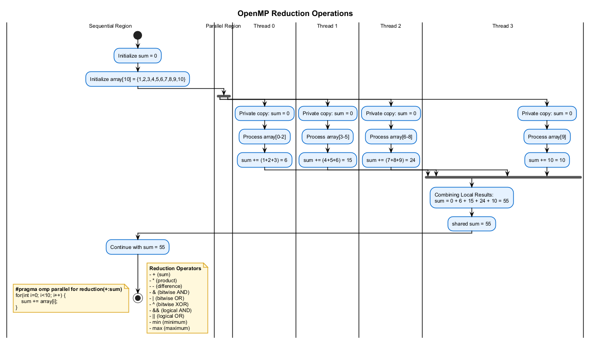

# ➕ OpenMP Reduction Operations

This project demonstrates the use of reduction operations in OpenMP to safely combine thread-local results in parallel computations.

## 🎯 Overview

Reduction operations are a powerful feature of OpenMP that allow multiple threads to safely combine their local results into a single global result. This is essential for operations like summing values, finding maximums/minimums, or applying other operations where multiple threads contribute to a final result.

## 📊 OpenMP Reduction Operations

The following diagram illustrates how reduction operations work in OpenMP:



## 🧩 Supported Reduction Operators

OpenMP supports the following reduction operators:

| Operator | Description             | Example                                      |
|----------|-------------------------|----------------------------------------------|
| `+`      | Sum                     | `#pragma omp parallel for reduction(+:sum)`  |
| `-`      | Difference              | `#pragma omp parallel for reduction(-:diff)` |
| `*`      | Product                 | `#pragma omp parallel for reduction(*:prod)` |
| `&`      | Bitwise AND             | `#pragma omp parallel for reduction(&:mask)` |
| `\|`     | Bitwise OR              | `#pragma omp parallel for reduction(\|:flags)` |
| `^`      | Bitwise XOR             | `#pragma omp parallel for reduction(^:bits)` |
| `&&`     | Logical AND             | `#pragma omp parallel for reduction(&&:all)` |
| `\|\|`   | Logical OR              | `#pragma omp parallel for reduction(\|\|:any)` |
| `min`    | Minimum                 | `#pragma omp parallel for reduction(min:min_val)` |
| `max`    | Maximum                 | `#pragma omp parallel for reduction(max:max_val)` |

## 💻 Basic Reduction Examples

### Sum Reduction

```cpp
int sum = 0;
#pragma omp parallel for reduction(+:sum)
for (int i = 0; i < 1000; i++) {
    sum += array[i];
}
// sum now contains the sum of all array elements
```

### Min/Max Reduction

```cpp
int min_val = INT_MAX;
int max_val = INT_MIN;
#pragma omp parallel for reduction(min:min_val) reduction(max:max_val)
for (int i = 0; i < 1000; i++) {
    min_val = (array[i] < min_val) ? array[i] : min_val;
    max_val = (array[i] > max_val) ? array[i] : max_val;
}
```

### Logical Reduction

```cpp
bool all_positive = true;
#pragma omp parallel for reduction(&&:all_positive)
for (int i = 0; i < 1000; i++) {
    all_positive = all_positive && (array[i] > 0);
}
```

## 🔍 Custom Reductions

OpenMP also supports custom reduction operations with user-defined types using the `declare reduction` directive:

```cpp
struct Vector { double x, y, z; };

// Declare a vector addition reduction
#pragma omp declare reduction(vec_add : Vector : omp_out = {omp_out.x + omp_in.x, \
                                                           omp_out.y + omp_in.y, \
                                                           omp_out.z + omp_in.z}) \
                    initializer(omp_priv = {0.0, 0.0, 0.0})

Vector sum = {0.0, 0.0, 0.0};
#pragma omp parallel for reduction(vec_add:sum)
for (int i = 0; i < 1000; i++) {
    // Perform vector addition
    sum.x += vectors[i].x;
    sum.y += vectors[i].y;
    sum.z += vectors[i].z;
}
```

## 📈 Performance Considerations

1. **Initialization Cost**: Each thread must initialize its private copy of the reduction variable
2. **Combining Cost**: Thread results must be combined at the end of the parallel region
3. **Vectorization**: Reduction loops can often be vectorized for additional performance
4. **Custom Reductions**: Custom reductions may have higher overhead than built-in operations

## 🚀 Running the Examples

Use the provided scripts to configure, build, and run the examples:

1. Run `configure.bat` to set up the CMake project
2. Run `build_all.bat` to compile all examples
3. Run `run.bat` to execute the examples

Example usage:

```bash
run.bat --debug --example sum_reduction
```

## 📚 Additional Resources

- [OpenMP Reduction Clause Specification](https://www.openmp.org/spec-html/5.0/openmpsu43.html)
- [Custom Reductions in OpenMP](https://www.openmp.org/spec-html/5.0/openmpsu107.html)
- [Reduction Patterns Guide](https://hpc-tutorials.llnl.gov/openmp/reduction/)

## License

This project is provided as open source under the MIT License.

## Author

[Your Name/Organization]

## Acknowledgments

- OpenMP Architecture Review Board for the OpenMP specification
- The C++ Standards Committee for C++17 features 