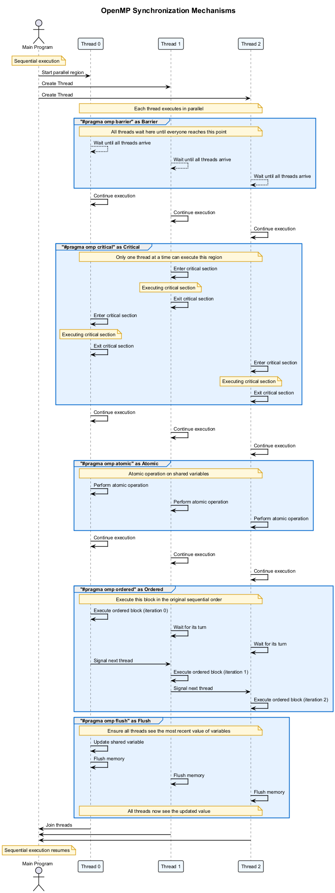

# 🔒 OpenMP Synchronization

This project demonstrates various OpenMP synchronization mechanisms and their performance implications.

## 🎯 Overview

In parallel programming, synchronization mechanisms are essential to coordinate thread activities and protect shared resources. OpenMP provides several synchronization constructs to prevent data races and ensure correct execution order.

## 📊 OpenMP Synchronization Mechanisms

The following diagram illustrates the key synchronization mechanisms in OpenMP:



## 🧩 Key Synchronization Constructs

### 1. `#pragma omp barrier`

Forces all threads to wait until everyone reaches this point, ensuring threads are synchronized before proceeding.

```cpp
#pragma omp parallel
{
    // Do some work
    
    #pragma omp barrier
    
    // All threads continue together from here
}
```

### 2. `#pragma omp critical`

Ensures that only one thread executes the enclosed block at a time, protecting shared resources from concurrent access.

```cpp
int sum = 0;
#pragma omp parallel
{
    int local_result = compute_something();
    
    #pragma omp critical
    {
        sum += local_result;  // Only one thread can update sum at a time
    }
}
```

### 3. `#pragma omp atomic`

Provides lightweight protection for simple updates to shared variables. More efficient than critical sections for basic operations.

```cpp
int counter = 0;
#pragma omp parallel for
for (int i = 0; i < 1000; i++) {
    #pragma omp atomic
    counter++;  // Atomic increment, no race condition
}
```

### 4. `#pragma omp ordered`

Ensures that a block of code is executed in the same order as the sequential loop would have done.

```cpp
#pragma omp parallel for ordered
for (int i = 0; i < 10; i++) {
    // Parallel work here
    
    #pragma omp ordered
    {
        cout << "Iteration " << i << endl;  // Will print in order: 0, 1, 2, ...
    }
}
```

### 5. `#pragma omp flush`

Ensures all threads have a consistent view of memory by forcing any stored values to be written back to memory.

```cpp
bool flag = false;
#pragma omp parallel sections
{
    #pragma omp section
    {
        // Thread 1 work
        flag = true;
        #pragma omp flush(flag)  // Make sure flag is visible to other threads
    }
    
    #pragma omp section
    {
        // Thread 2 work
        #pragma omp flush(flag)  // Read the updated value of flag
        if (flag) { /* react to flag */ }
    }
}
```

### 6. Locks

OpenMP provides explicit lock routines for more complex synchronization needs:

```cpp
omp_lock_t my_lock;
omp_init_lock(&my_lock);

#pragma omp parallel
{
    // Do some work
    
    omp_set_lock(&my_lock);
    // Critical section here
    omp_unset_lock(&my_lock);
    
    // More work
}

omp_destroy_lock(&my_lock);
```

## 💻 Examples in This Project

This project includes the following examples:

1. **Basic Synchronization**: Demonstrates barriers, critical sections, and atomic operations
2. **Lock Performance**: Compares different lock types (simple, nested, read/write)
3. **False Sharing**: Shows how thread synchronization can lead to false sharing
4. **Ordered Execution**: Demonstrates the ordered construct for sequential ordering

## 📈 Performance Considerations

1. **Synchronization Overhead**: All synchronization introduces some overhead
2. **Granularity**: Coarse-grained (less frequent) synchronization generally performs better than fine-grained
3. **Critical vs. Atomic**: Atomic operations are lighter weight for simple operations
4. **Lock Contention**: High contention for locks can significantly reduce performance
5. **Barrier Costs**: Barriers force all threads to wait for the slowest thread

## 🚀 Running the Examples

Use the provided scripts to configure, build, and run the examples:

1. Run `configure.bat` to set up the CMake project
2. Run `build_all.bat` to compile all examples
3. Run `run.bat` to execute the examples

Example usage:

```bash
run.bat --debug --example lock_comparison
```

## 📚 Additional Resources

- [OpenMP Synchronization Constructs](https://www.openmp.org/spec-html/5.0/openmpsu45.html)
- [OpenMP Lock Routines](https://www.openmp.org/spec-html/5.0/openmpsu96.html)
- [Performance Guide for OpenMP Synchronization](https://www.openmp.org/wp-content/uploads/openmp-examples-4.5.0.pdf)

## Prerequisites

- Windows 11
- Visual Studio 2022 Community Edition (or newer)
- CMake 3.20 or higher
- C++17 compatible compiler

## Building and Running

### Step 1: Configure

Run the configuration script:
```
configure.bat
```

### Step 2: Build

Build the project in Debug and Release configurations:
```
build_all.bat
```

### Step 3: Run

Use the unified `run.bat` script with various options:

```
run.bat                          # Run with default settings (Release mode)
run.bat --debug                  # Run in Debug mode with additional diagnostics
run.bat --release                # Run in Release mode (optimized performance)
run.bat --threads 8              # Run with 8 threads
run.bat --sync critical          # Run only critical section examples
run.bat --verbose                # Run with verbose output
run.bat --help                   # Show all available options
```

For the most comprehensive experience, you can use:

```
run_all.bat                      # Run all demonstrations in sequence
```

This will execute all synchronization examples with various thread counts and performance comparisons.

For specific synchronization mechanisms, we also provide:

```
run.bat --sync critical          # Demonstrate critical sections
run.bat --sync atomic            # Demonstrate atomic operations
run.bat --sync ordered           # Demonstrate ordered constructs
run.bat --sync barrier           # Demonstrate barriers
run.bat --sync nowait            # Demonstrate nowait clause
```

**Note**: For accurate performance measurements, always use the Release build.

### Step 4: Clean

If you want to clean the build files and start from scratch:

```
clean.bat
```

This will remove all build artifacts and temporary files.

### Command-Line Arguments

The program supports various command-line arguments:

```
Usage: OpenMP_Synchronization [options]

Options:
  -h, --help                  Show this help message
  -b, --benchmark             Run in benchmark mode
  -p, --performance           Run performance analysis
  -t, --threads <num>         Specify number of threads (0 for default)
  -w, --workload <size>       Specify workload size
  -d, --demo <n>              Run a specific demo by name

Examples:
  OpenMP_Synchronization                              Run interactive menu
  OpenMP_Synchronization --benchmark                  Run all benchmarks
  OpenMP_Synchronization --threads 4 --workload 1000000  Run with 4 threads and specified workload
  OpenMP_Synchronization --demo "Basic Critical Sections"  Run a specific demo
```

## Visualization Tools

The project includes visualization tools to help understand thread behavior and synchronization:

- Thread timeline visualization
- Lock contention visualization
- Memory consistency visualization

## Understanding the Results

### Performance Overhead

Each synchronization mechanism introduces different levels of overhead:

1. **Critical Sections**: Highest overhead but most flexible
2. **Atomic Operations**: Lower overhead than critical sections, limited functionality
3. **Barriers**: High overhead, used for coordinating all threads
4. **Master/Single**: Medium overhead, used when a section should be executed by one thread

### Scalability

The examples demonstrate how different synchronization approaches scale with:
- Increasing thread counts
- Increasing workload sizes

## Best Practices

### 1. Minimize Synchronization

- Use as little synchronization as possible
- Synchronization creates bottlenecks and reduces parallelism

### 2. Use the Right Mechanism

- Use atomic operations for simple updates to shared variables
- Use critical sections when more complex code needs protection
- Use locks for more fine-grained control

### 3. Reduce Contention

- Use named critical sections to allow non-competing code to run in parallel
- Minimize the code inside critical sections
- Use thread-local storage when possible

## License

This project is licensed under the MIT License - see the LICENSE file for details.

## Acknowledgments

- OpenMP Architecture Review Board for the OpenMP specification
- Microsoft Visual Studio and Intel teams for their OpenMP implementations

## Contact

If you have any questions or feedback, please open an issue on the project repository. 