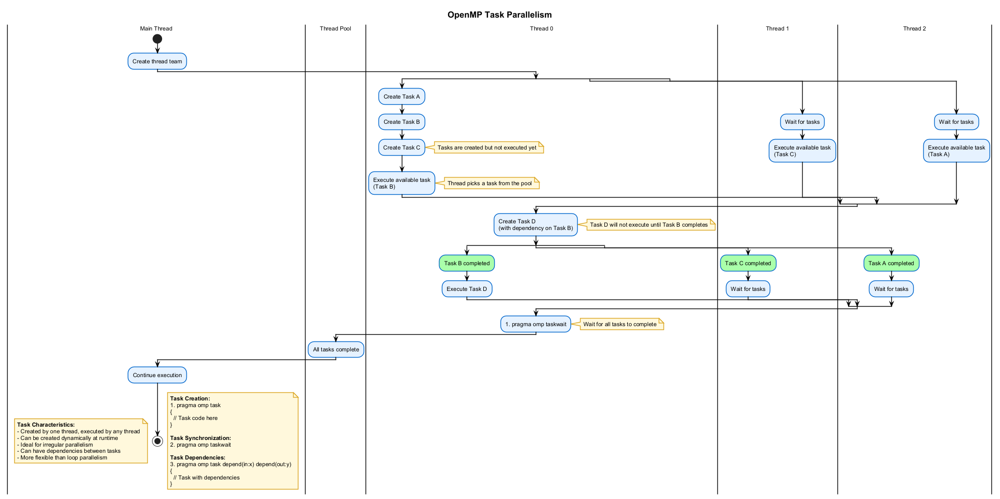

# 📋 OpenMP Task Parallelism

This project demonstrates the use of OpenMP tasks for irregular parallel computations that can't be easily expressed with parallel loops.

## 🎯 Overview

Task parallelism allows for more flexible parallel execution patterns than regular parallel loops, especially for irregular workloads, recursive algorithms, and producer-consumer scenarios. OpenMP tasks create units of work that can be dynamically scheduled to run on available threads.

## 📊 OpenMP Task Parallelism

The following diagram illustrates how OpenMP tasks work:



## 🧩 Task Creation and Execution

### 1. Basic Task Creation

```cpp
#pragma omp parallel
{
    #pragma omp single
    {
        for (int i = 0; i < 100; i++) {
            #pragma omp task
            {
                // This code runs as a task, potentially on any thread
                process_item(i);
            }
        }
    } // Implicit barrier, wait for all tasks to complete
}
```

### 2. Task Data Sharing

Tasks inherit variables from their parent context, but use the `firstprivate` clause by default. You can change this with data-sharing clauses:

```cpp
int shared_var = 0;
#pragma omp parallel
{
    int thread_var = omp_get_thread_num();
    
    #pragma omp single
    {
        #pragma omp task shared(shared_var) firstprivate(thread_var)
        {
            // shared_var is shared among tasks
            // thread_var is private to this task with initial value
            shared_var++;
        }
    }
}
```

### 3. Task Synchronization

The `taskwait` directive waits for direct child tasks to complete:

```cpp
#pragma omp parallel
{
    #pragma omp single
    {
        #pragma omp task
        {
            heavy_computation_1();
            
            #pragma omp task
            {
                nested_task();
            }
            
            #pragma omp taskwait  // Wait for nested_task() to complete
            dependent_computation();
        }
        
        #pragma omp task
        {
            heavy_computation_2();
        }
    } // Implicit barrier waits for all tasks
}
```

### 4. Task Dependencies

Task dependencies enable specifying data flow constraints between tasks:

```cpp
int x = 0, y = 0;
#pragma omp parallel
{
    #pragma omp single
    {
        #pragma omp task depend(out: x)
        {
            x = compute_x();
        }
        
        #pragma omp task depend(out: y)
        {
            y = compute_y();
        }
        
        #pragma omp task depend(in: x, y) depend(out: z)
        {
            // This task will only run after both x and y are computed
            z = x + y;
        }
    }
}
```

## 💻 Examples in This Project

This project includes the following examples:

1. **Basic Task Creation**: Creating and executing simple tasks
2. **Recursive Parallelism**: Implementing recursive algorithms with tasks
3. **Task Dependencies**: Using task dependencies to express data flow
4. **Unbalanced Workloads**: Handling irregular computations with tasks
5. **Producer-Consumer**: Implementing a producer-consumer pattern with tasks

## 📈 Common Task Patterns

### Recursive Algorithm (e.g., Fibonacci)

```cpp
int fib(int n) {
    int x, y;
    if (n < 2) return n;
    
    #pragma omp task shared(x)
    x = fib(n-1);
    
    #pragma omp task shared(y)
    y = fib(n-2);
    
    #pragma omp taskwait
    return x + y;
}

// Main code
#pragma omp parallel
{
    #pragma omp single
    {
        result = fib(n);
    }
}
```

### Producer-Consumer Pattern

```cpp
#pragma omp parallel
{
    #pragma omp single
    {
        int data;
        bool more_data = true;
        
        while (more_data) {
            // Producer
            data = produce_data(&more_data);
            
            // Consumer (runs as a task)
            #pragma omp task firstprivate(data)
            {
                consume_data(data);
            }
        }
    }
}
```

## 🔍 Performance Considerations

1. **Task Granularity**: Tasks should be substantial enough to justify the overhead of task creation
2. **Task Cut-off**: For recursive algorithms, switch to sequential execution when tasks become too small
3. **Load Balancing**: Tasks provide good load balancing for uneven workloads
4. **Excessive Tasks**: Creating too many fine-grained tasks can add significant overhead
5. **Thread Synchronization**: Consider using task dependencies instead of explicit synchronization

## 🚀 Running the Examples

Use the provided scripts to configure, build, and run the examples:

1. Run `configure.bat` to set up the CMake project
2. Run `build_all.bat` to compile all examples
3. Run `run.bat` to execute the examples

Example usage:

```bash
run.bat --debug --example recursive_tasks
```

## 📚 Additional Resources

- [OpenMP Task Constructs Specification](https://www.openmp.org/spec-html/5.0/openmpsu46.html)
- [OpenMP Task Dependency Specification](https://www.openmp.org/spec-html/5.0/openmpsu79.html)
- [Task-Based Parallelism Guide](https://www.openmp.org/wp-content/uploads/openmp-examples-4.5.0.pdf)