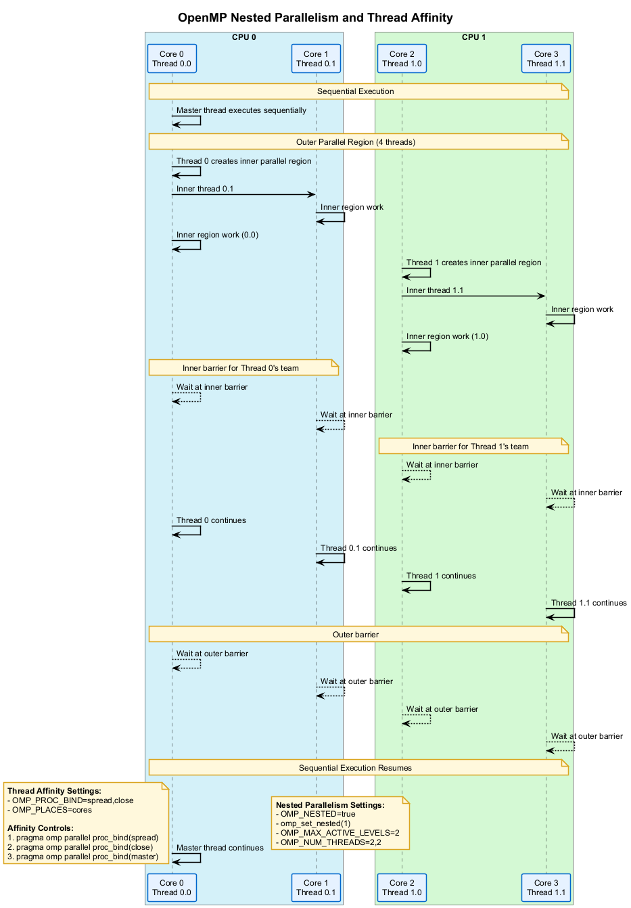

# 🧵 OpenMP Nested Parallelism and Thread Affinity

This project demonstrates advanced OpenMP features for controlling nested parallel regions and thread affinity to optimize performance on multi-core and NUMA architectures.

## 🎯 Overview

Nested parallelism allows for creating parallel regions within existing parallel regions, enabling more complex parallel algorithms. Thread affinity provides control over which physical cores or processors threads are executed on, which can significantly impact performance.

## 📊 Nested Parallelism and Thread Affinity

The following diagram illustrates how nested parallelism and thread affinity work in OpenMP:



## 🧩 Nested Parallelism

Nested parallelism is disabled by default in OpenMP but can be enabled using environment variables or runtime API calls.

### Enabling Nested Parallelism

```cpp
// Using environment variables (before running the program)
// OMP_NESTED=true
// OMP_MAX_ACTIVE_LEVELS=n

// Using runtime API calls
omp_set_nested(1);  // Enable nested parallelism
omp_set_max_active_levels(n);  // Set maximum nesting level
```

### Creating Nested Parallel Regions

```cpp
#pragma omp parallel num_threads(2)  // Outer parallel region with 2 threads
{
    // Outer parallel region code
    int outer_tid = omp_get_thread_num();
    
    #pragma omp parallel num_threads(2)  // Inner parallel region with 2 threads per outer thread
    {
        // Inner parallel region code
        int inner_tid = omp_get_thread_num();
        int team_id = omp_get_team_num();  // OpenMP 5.0 feature
        
        printf("Outer thread %d, inner thread %d, team %d\n", 
               outer_tid, inner_tid, team_id);
    }
}
```

## 🔄 Thread Affinity

Thread affinity controls where threads execute on hardware resources, which can reduce memory access latency and improve cache utilization.

### Affinity Control Methods

```cpp
// Using environment variables
// OMP_PROC_BIND=spread|close|master
// OMP_PLACES=threads|cores|sockets

// Using directives
#pragma omp parallel proc_bind(spread)
{
    // Threads are spread across all cores
}

#pragma omp parallel proc_bind(close)
{
    // Threads are placed close to the parent thread
}

#pragma omp parallel proc_bind(master)
{
    // Threads are placed on the same place as the master thread
}
```

### Affinity Policies

1. **`spread`**: Distributes threads evenly across the available resources
2. **`close`**: Places threads close to the parent thread
3. **`master`**: Places threads on the same resources as the master thread

### Places Definition

1. **`threads`**: Hardware threads (including SMT/hyperthreading)
2. **`cores`**: Physical cores
3. **`sockets`**: CPU sockets/packages

## 💻 Examples in This Project

This project includes the following examples:

1. **Basic Nested Parallelism**: Demonstrates creating and controlling nested parallel regions
2. **Thread Affinity Policies**: Compares different thread binding policies
3. **NUMA-Aware Programming**: Shows how to optimize for Non-Uniform Memory Access architectures
4. **Hierarchical Parallelism**: Implements different parallelization strategies at different levels

## 📈 Performance Considerations

1. **Nested Parallelism Overhead**: Creating nested parallel regions adds overhead
2. **Thread Oversubscription**: Creating too many threads can degrade performance
3. **NUMA Effects**: On NUMA systems, thread and memory placement is critical
4. **Cache Sharing**: Thread placement affects cache sharing behavior
5. **Load Balancing**: Different affinity policies affect load balancing behavior

## 🚀 Running the Examples

Use the provided scripts to configure, build, and run the examples:

1. Run `configure.bat` to set up the CMake project
2. Run `build_all.bat` to compile all examples
3. Run `run.bat` to execute the examples

Example usage:

```bash
set OMP_NESTED=true
set OMP_MAX_ACTIVE_LEVELS=2
set OMP_PROC_BIND=spread,close
set OMP_PLACES=cores
run.bat --debug --example nested_matrix_multiply
```

## 📚 Additional Resources

- [OpenMP Nested Parallelism](https://www.openmp.org/spec-html/5.0/openmpsu48.html)
- [OpenMP Thread Affinity](https://www.openmp.org/spec-html/5.0/openmpsu47.html)
- [NUMA Optimization Guide](https://software.intel.com/content/www/us/en/develop/articles/optimizing-for-numa.html)