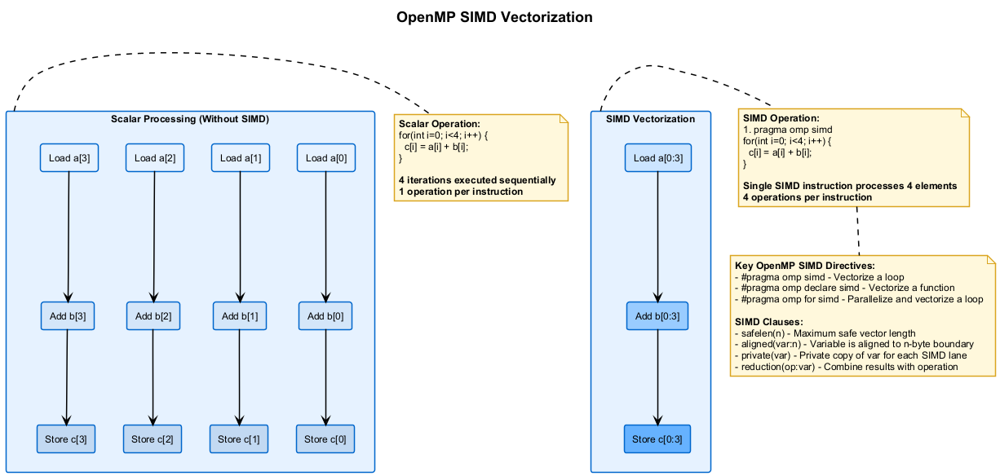

# 🚀 OpenMP SIMD Vectorization

This project demonstrates the use of OpenMP SIMD directives to enable vectorization for high-performance computing.

## 🎯 Overview

Single Instruction Multiple Data (SIMD) vectorization allows a single CPU instruction to operate on multiple data elements simultaneously, providing significant performance improvements for data-parallel operations. OpenMP provides directives to help compilers generate efficient SIMD instructions.

## 📊 SIMD Vectorization

The following diagram illustrates how SIMD vectorization compares to scalar operations:



## 🧩 Key SIMD Directives

### 1. `#pragma omp simd`

Vectorizes a loop without parallelizing it:

```cpp
#pragma omp simd
for (int i = 0; i < N; i++) {
    c[i] = a[i] + b[i];  // This operation is vectorized
}
```

### 2. `#pragma omp parallel for simd`

Combines loop parallelization with vectorization:

```cpp
#pragma omp parallel for simd
for (int i = 0; i < N; i++) {
    c[i] = a[i] + b[i];  // This loop is both parallelized and vectorized
}
```

### 3. `#pragma omp declare simd`

Marks a function for vectorization:

```cpp
#pragma omp declare simd
float square(float x) {
    return x * x;  // This function can be called in a vectorized context
}

#pragma omp simd
for (int i = 0; i < N; i++) {
    results[i] = square(data[i]);  // Calls to square() are vectorized
}
```

## 💻 Important SIMD Clauses

### Alignment

Specifying data alignment can improve performance:

```cpp
// Aligned allocation
float* a = (float*)_mm_malloc(N * sizeof(float), 32);  // 32-byte alignment

#pragma omp simd aligned(a:32)
for (int i = 0; i < N; i++) {
    a[i] = a[i] * 2.0f;
}
```

### Safelen

Specifies the maximum number of iterations that can safely be vectorized together:

```cpp
#pragma omp simd safelen(16)
for (int i = 0; i < N; i++) {
    a[i] = a[i-1] + a[i+1];  // Has dependency, but safe within blocks of 16
}
```

### Linear

Specifies variables with a linear relationship to the loop counter:

```cpp
#pragma omp simd linear(p:1)
for (int i = 0; i < N; i++) {
    *p = i * 2;  // p is incremented by 1 each iteration
    p++;
}
```

## 📈 Performance Considerations

1. **Data Alignment**: Align data to the appropriate boundaries for your architecture (32 bytes for AVX/AVX2)
2. **Memory Access Patterns**: Consecutive memory access patterns are better for SIMD performance
3. **Conditional Statements**: Branches can significantly reduce SIMD efficiency (mask operations are used)
4. **Function Calls**: Simple functions with `declare simd` can be inlined for vectorization
5. **Loop Dependencies**: Loops with dependencies may not vectorize efficiently or at all

## 🔍 Vectorization Verification

To verify that your code is actually vectorized:

1. **Compiler Reports**: Most compilers can generate vectorization reports:
   - MSVC: `/Qvec-report:2`
   - GCC/Clang: `-fopt-info-vec` or `-fopt-info-vec-missed`

2. **Performance Measurement**: Create vectorized and scalar versions and compare performance

3. **CPU Performance Counters**: Tools like Intel VTune can show SIMD instruction usage

## 💻 Examples in This Project

This project includes the following examples:

1. **Basic Vectorization**: Simple array operations with `simd` directives
2. **Combined Threading and Vectorization**: Using `parallel for simd`
3. **Function Vectorization**: Using `declare simd` for function vectorization
4. **Alignment and Performance**: Demonstrating the impact of data alignment
5. **Vectorization Reports**: Generating and interpreting vectorization reports

## 🚀 Running the Examples

Use the provided scripts to configure, build, and run the examples:

1. Run `configure.bat` to set up the CMake project
2. Run `build_all.bat` to compile all examples
3. Run `run.bat` to execute the examples

Example usage:

```bash
run.bat --debug --example simd_performance
```

## 📚 Additional Resources

- [OpenMP SIMD Directives](https://www.openmp.org/spec-html/5.0/openmpsu43.html)
- [Intel Vectorization Guide](https://software.intel.com/content/www/us/en/develop/documentation/cpp-compiler-developer-guide-and-reference/top/optimization-and-programming-guide/vectorization/automatic-vectorization.html)
- [SIMD Programming Manual](https://www.openmp.org/wp-content/uploads/openmp-examples-4.5.0.pdf)