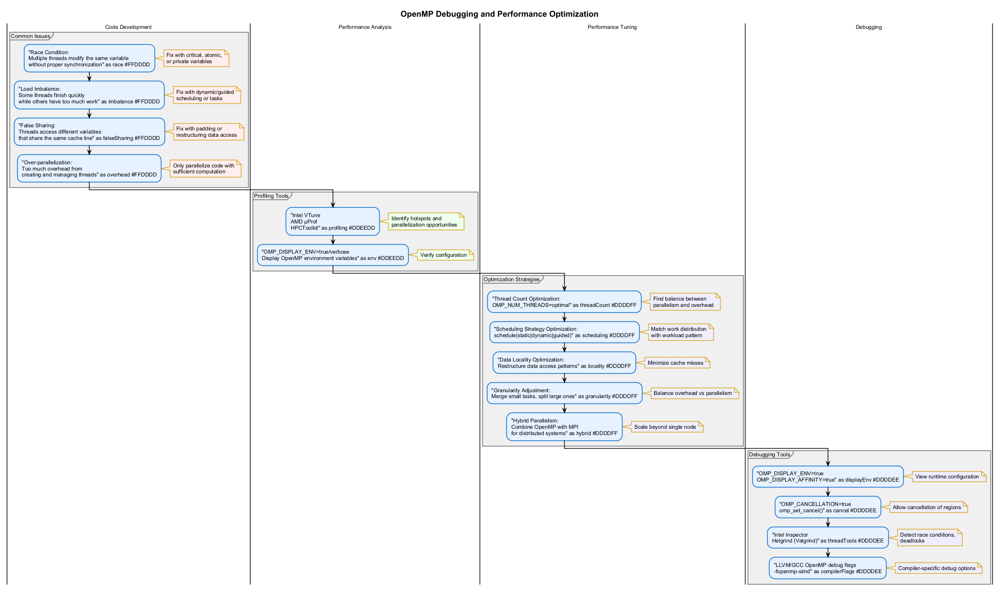

# 🛠️ OpenMP Debugging and Performance Optimization

This project demonstrates techniques for debugging OpenMP programs and optimizing their performance.

## 🎯 Overview

Debugging parallel programs is more challenging than debugging sequential code due to non-determinism, race conditions, and complex execution flows. This module covers common OpenMP issues and provides strategies for identifying and resolving them, as well as techniques for optimizing performance.

## 📊 OpenMP Debugging and Performance Optimization

The following diagram illustrates common issues and optimization strategies in OpenMP programs:



## 🧩 Common OpenMP Issues

### 1. Race Conditions

Race conditions occur when multiple threads access and modify the same data without proper synchronization:

```cpp
int counter = 0;

#pragma omp parallel for
for (int i = 0; i < N; i++) {
    counter++;  // Race condition: multiple threads updating counter
}
```

**Solution**: Use critical sections, atomic operations, or reduction clauses:

```cpp
int counter = 0;

#pragma omp parallel for reduction(+:counter)
for (int i = 0; i < N; i++) {
    counter++;  // Safe: using reduction
}
```

### 2. False Sharing

False sharing occurs when threads access different variables that share the same cache line:

```cpp
struct {
    int counter1;  // Thread 1 updates this
    int counter2;  // Thread 2 updates this
} shared_data;

// Threads repeatedly updating counter1 and counter2 cause cache line bouncing
```

**Solution**: Add padding or restructure data to avoid sharing cache lines:

```cpp
struct {
    int counter1;
    char pad1[60];  // Padding to ensure different cache lines
    int counter2;
    char pad2[60];
} shared_data;
```

### 3. Load Imbalance

Load imbalance occurs when some threads finish early while others continue working:

```cpp
#pragma omp parallel for schedule(static)
for (int i = 0; i < N; i++) {
    process(i);  // If process(i) takes varying time, static scheduling causes imbalance
}
```

**Solution**: Use dynamic or guided scheduling:

```cpp
#pragma omp parallel for schedule(dynamic)
for (int i = 0; i < N; i++) {
    process(i);  // Dynamic scheduling improves load balance
}
```

## 🔍 Debugging Techniques

### 1. Using Environment Variables

```bash
# Display OpenMP information at runtime
export OMP_DISPLAY_ENV=true

# Enable cancellation points for debugging
export OMP_CANCELLATION=true

# Show thread affinity information
export OMP_DISPLAY_AFFINITY=true
```

### 2. Using Runtime API Calls

```cpp
// Check if running in parallel region
if (omp_in_parallel()) {
    printf("Thread %d: In parallel region\n", omp_get_thread_num());
}

// Get nested level
int level = omp_get_level();
printf("Current parallel nesting level: %d\n", level);

// Get team size at a specific level
int team_size = omp_get_team_size(level);
printf("Team size at level %d: %d\n", level, team_size);
```

### 3. Using Cancellation Points

```cpp
#pragma omp parallel for
for (int i = 0; i < N; i++) {
    if (check_for_error(i)) {
        #pragma omp cancel for
    }
    
    // Process data
    
    #pragma omp cancellation point for
}
```

## 📈 Performance Optimization Strategies

### 1. Thread Count Optimization

Finding the optimal number of threads for your application:

```cpp
// Test different thread counts
for (int threads = 1; threads <= omp_get_max_threads(); threads++) {
    omp_set_num_threads(threads);
    
    double start_time = omp_get_wtime();
    // Run parallel code
    double end_time = omp_get_wtime();
    
    printf("Threads: %d, Time: %.4f seconds\n", threads, end_time - start_time);
}
```

### 2. Scheduling Strategy Optimization

Choose the best scheduling strategy for your workload:

```cpp
// Compare different scheduling strategies
const char* schedules[] = {"static", "dynamic", "guided"};
for (const char* sched : schedules) {
    setenv("OMP_SCHEDULE", sched, 1);
    
    double start_time = omp_get_wtime();
    #pragma omp parallel for schedule(runtime)
    for (int i = 0; i < N; i++) {
        process(i);
    }
    double end_time = omp_get_wtime();
    
    printf("Schedule: %s, Time: %.4f seconds\n", sched, end_time - start_time);
}
```

### 3. Data Locality Optimization

Improve memory access patterns to reduce cache misses:

```cpp
// Optimized for row-major access (better locality)
#pragma omp parallel for
for (int i = 0; i < rows; i++) {
    for (int j = 0; j < cols; j++) {
        matrix[i][j] = compute(i, j);
    }
}
```

## 💻 Examples in This Project

This project includes the following examples:

1. **Race Condition Detection**: Identifying and fixing data races
2. **False Sharing Analysis**: Measuring and mitigating false sharing
3. **Thread Scaling Analysis**: Finding the optimal thread count
4. **Scheduling Strategy Comparison**: Evaluating different scheduling strategies
5. **Memory Access Optimization**: Improving data locality

## 🚀 Running the Examples

Use the provided scripts to configure, build, and run the examples:

1. Run `configure.bat` to set up the CMake project
2. Run `build_all.bat` to compile all examples
3. Run `run.bat` to execute the examples

Example usage:

```bash
run.bat --debug --example race_detection
```

## 🔬 Analysis Tools

Several external tools can help with OpenMP debugging and performance analysis:

1. **Intel Inspector**: Detects threading errors like race conditions and deadlocks
2. **Intel VTune Profiler**: Analyzes performance and identifies bottlenecks
3. **Valgrind (Helgrind)**: Detects synchronization errors on Linux systems
4. **Performance Counters**: Hardware counters for detailed performance metrics

## 📚 Additional Resources

- [OpenMP Common Problems](https://www.openmp.org/wp-content/uploads/openmp-examples-4.5.0.pdf)
- [Intel Parallel Studio Documentation](https://software.intel.com/content/www/us/en/develop/documentation/inspector-user-guide/top.html)
- [Performance Tuning Guide](https://hpc-tutorials.llnl.gov/openmp/performance/)

## System Requirements

- Windows 11 (or Windows 10 with latest updates)
- Visual Studio 2022 Community Edition or higher
- CMake 3.20 or higher
- OpenMP-compatible compiler (MSVC)
- Optional: Intel VTune Profiler for advanced performance analysis

## Directory Structure

- `src/` - Implementation files for examples and tools
  - `fixes/` - Fixed versions of the example issues
  - `diagnostics/` - Diagnostic tool integrations
  - `visualization/` - Performance visualization tools
- `include/` - Header files
- `utils/` - Utility functions and shared code
- `scripts/` - Batch files for environment setup and tool execution
- `reports/` - Generated performance reports (created at runtime)
- `docs/` - Documentation files

## Building the Project

The project uses CMake for building. Follow these steps to build the project:

1. Make sure you have Visual Studio 2022 and CMake 3.20+ installed
2. Run the configuration script:
   ```
   configure.bat
   ```
3. Build the project:
   ```
   build_all.bat
   ```

This will create executables for each example in Debug, Release, and Profile configurations.

## Running the Examples

To run the examples, use the provided batch files:

- `run.bat` - Run all examples with default options
- `run_debug.bat` - Run examples with detailed debugging output
- `run_release.bat` - Run optimized release builds
- `scripts/run_issue_examples.bat` - Run specific issue examples
- `scripts/run_diagnostics.bat` - Run the diagnostics tools

Each example can also be run individually from the `build/bin/{Config}` directories.

## Viewing Results

When you run the visualization tools or diagnostic examples, they will generate HTML reports in the `reports/` directory. Open these in any web browser to view the visualizations and analysis results.

## Debugging OpenMP Programs

For comprehensive guidance on debugging OpenMP programs, see the [Debugging Guide](DEBUGGING_GUIDE.md). This includes:

- Setting up Visual Studio for OpenMP debugging
- Thread debugging techniques
- Race condition detection
- Common issues and solutions

## Performance Analysis

For performance analysis tips and methodologies, refer to the [Performance Analysis Guide](PERFORMANCE_ANALYSIS_GUIDE.md). This guide covers:

- Performance measurement tools
- Profiling techniques
- Performance bottleneck identification
- Optimization strategies

## Common Issue Patterns

For a catalog of common OpenMP bugs and performance issues, see the [Issue Patterns](ISSUE_PATTERNS.md) document. This includes:

- Detailed descriptions of each issue
- Detection techniques
- Root cause analysis
- Solution patterns

## Visual Studio Extensions

For information on helpful Visual Studio extensions for OpenMP development, see the [VS Extensions](vs_extensions.md) document.

## License

This project is provided for educational purposes and is available under the MIT License.

## Acknowledgements

This project uses several open-source libraries and tools, and leverages the extensive documentation provided by the OpenMP Architecture Review Board, Intel, and Microsoft. 