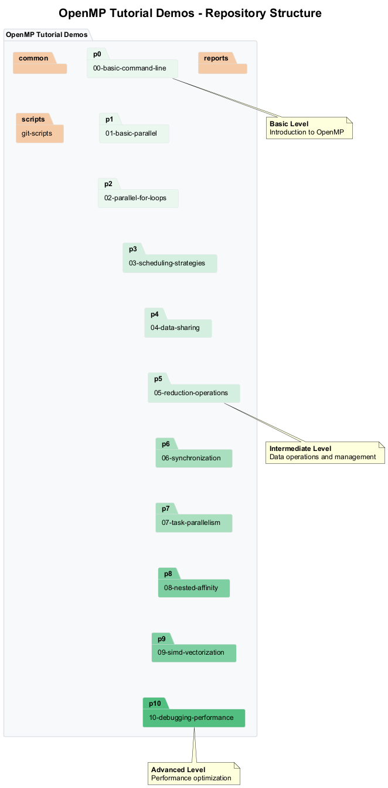

# 🧩 OpenMP Tutorial Demos

This repository contains a collection of comprehensive OpenMP examples demonstrating various parallel programming concepts using C++ with Visual Studio 2022 on Windows. Each demo is a self-contained project with full CMake support, detailed documentation, and batch files for easy building and execution.

## 📊 Repository Structure

The repository is organized into the following sections:



1. **🔰 Basic Command Line** - Introduction to OpenMP compiler options and basic flags
2. **🔄 Basic Parallel Regions** - Introduction to OpenMP parallel regions
3. **🔁 Parallel For Loops** - Parallelizing loops with different approaches
4. **⚙️ Scheduling Strategies** - Comparison of different work distribution strategies
5. **💾 Data Sharing** - Demonstration of variable scoping and data sharing clauses
6. **➕ Reduction Operations** - Various reduction operations and custom reductions
7. **🔒 Synchronization** - Different synchronization mechanisms with performance comparisons
8. **📋 Task Parallelism** - Task-based programming for irregular parallelism
9. **🧵 Nested Parallelism & Affinity** - Nested parallel regions and thread affinity controls
10. **🚀 SIMD Vectorization** - Data parallelism with SIMD instructions
11. **🛠️ Debugging & Performance** - Techniques for finding and fixing common OpenMP issues

Each folder contains its own README.md with detailed explanations, diagrams, and instructions.

## 🔍 Prerequisites

- Windows 10/11
- Visual Studio 2022 Community Edition
- CMake 3.20 or higher
- C++17 compatible compiler

## 🚀 Getting Started

Each project includes:

- A complete CMakeLists.txt configuration
- Source code with extensive comments
- Batch files for configuration, building, and running
- Documentation explaining concepts and implementation
- Visual diagrams illustrating key concepts

To run any example:

1. Navigate to the example directory
2. Run `configure.bat` to set up the CMake project
3. Run `build_all.bat` to compile the example in all configurations
4. Run `run.bat` to execute the example with default settings

### 📜 Improved Script System

The projects now use a unified script system for easier usage:

- `configure.bat` - Sets up the CMake project (run once)
- `build_all.bat` - Builds Debug, Release, and Profile configurations
- `clean.bat` - Removes build files for a fresh start
- `run.bat` - Unified script with multiple options:
  - `--debug`, `--release`, `--profile` - Select build configuration
  - `--verbose`, `--quick`, `--benchmark` - Run mode options
  - `--threads N` - Set number of OpenMP threads
  - `--example NAME` - Run specific example
  - `--help` - Show all available options
- `run_all.bat` - Runs examples in different configurations sequentially

Example usages:
```
run.bat --debug --verbose
run.bat --release --benchmark --threads 8
run.bat --example race_conditions
```

## 🎓 Learning Path

For best results, follow the examples in numerical order as they build upon concepts introduced in previous demos.

## 📚 Additional Resources

- [OpenMP Official Documentation](https://www.openmp.org/resources/refguides/)
- [Microsoft OpenMP Documentation](https://docs.microsoft.com/en-us/cpp/parallel/openmp/openmp-in-visual-cpp)
- [Using OpenMP Book](https://mitpress.mit.edu/books/using-openmp)

## 📝 License

This project is licensed under the MIT License - see the LICENSE file for details.

## 🙏 Acknowledgments

- OpenMP Architecture Review Board for the OpenMP specification
- Microsoft for Visual Studio and MSVC OpenMP implementation

## 🤝 Contributing

Contributions are welcome! Please feel free to submit a Pull Request.
